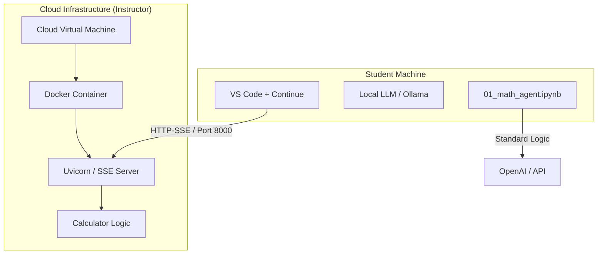
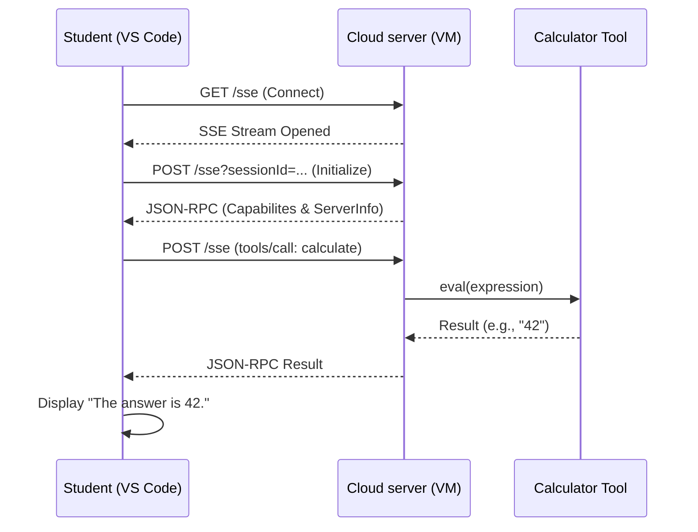

# Cloud MCP Calculator: Student & Instructor Guide

This repository contains a cloud-deployable math tool server using the **Model Context Protocol (MCP)** via **Server-Sent Events (SSE)**. This architecture allows students to connect their local local LLM agents (via VS Code Continue) to a centralized, instructor-managed tool.

## Distributed Architecture

The following diagram shows how the system is distributed between the instructor's cloud infrastructure and the students' local machines.



## Protocol Interaction Flow

When a student asks a math question, the following exchange occurs via the SSE protocol:



## Student Setup (config.yaml)

To connect to the cloud tool, update your `~/.continue/config.yaml` as follows:

```yaml
mcpServers:
  - name: cloud-calc
    type: sse
    url: http://<YOUR-VM-PUBLIC-IP>:8000/sse

experimental:
  autoExecuteTools: true
```

## Instructor Setup (Makefile)

Use the provided [Makefile](./Makefile) on your VM to manage the service easily:

| Command | Action |
| :--- | :--- |
| `make build` | Builds the `mcp-calculator` Docker image. |
| `make run` | Starts the server in background (detached) on port 8000. |
| `make logs` | Follows the live server logs (useful for debugging student connections). |
| `make stop` | Gracefully stops and removes the running container. |

### VM Security Note:
Ensure your VM's Cloud Firewall (Security Group) allows **Inbound TCP traffic on Port 8000**.
