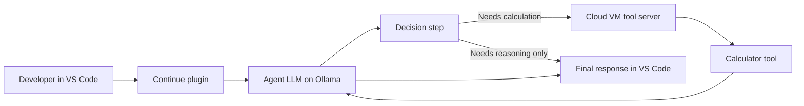
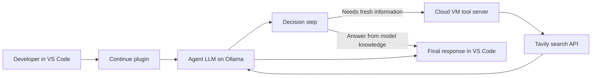
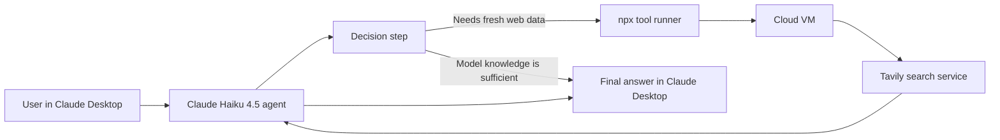

### Calculator Agent (cloud hosted)

```mermaid
flowchart LR
    A[Developer in VS Code]
    B[Continue plugin]
    C[Agent LLM on Ollama]
    D[Decision step]
    E[Cloud VM tool server]
    F[Calculator tool]
    G[Final response in VS Code]

    A --> B
    B --> C
    C --> D
    D -->|Needs reasoning only| G
    D -->|Needs calculation| E
    E --> F
    F --> C
    C --> G
```

### Tavily Search (cloud hosted)

```mermaid
flowchart LR
    A[Developer in VS Code]
    B[Continue plugin]
    C[Agent LLM on Ollama]
    D[Decision step]
    E[Cloud VM tool server]
    F[Tavily search API]
    G[Final response in VS Code]

    A --> B
    B --> C
    C --> D
    D -->|Answer from model knowledge| G
    D -->|Needs fresh information| E
    E --> F
    F --> C
    C --> G
```

### Claude Desktop (Agent-search)

```mermaid
flowchart LR
    A[User in Claude Desktop]
    B[Claude Haiku 4.5 agent]
    C[Decision step]
    D[npx tool runner]
    E[Cloud VM]
    F[Tavily search service]
    G[Final answer in Claude Desktop]

    A --> B
    B --> C
    C -->|Model knowledge is sufficient| G
    C -->|Needs fresh web data| D
    D --> E
    E --> F
    F --> B
    B --> G
```

